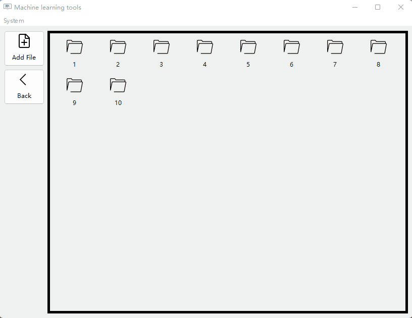

一个使用`pyside6`做的练手项目，主要还是为了熟悉`pyside6`

### todo list

- [ ] 优化 File model
  - [ ] 文件名，文件夹名重命名
  - [ ] 文件存在判定
  - [ ] 文件合并（主要是针对md）
  - [ ] 文件预览（暂时考虑 typora,  vscode 和txt三种打开方式）
- [ ] 多选文件与批量操作
- [ ] 文件选中和非选中状态差异化
- [x] sqlite支持
- [ ] 项目管理，一个项目对应一个`structure.json`文件，每个项目中根据文件md5存入sqlite数据库，`structure`中也只存md5(主键)
- [ ] 新建项目，打开上一次的项目，等等功能
- [ ] 项目文件数量统计，项目文件大小汇总
- [ ] 自动更新（没想好怎么做）